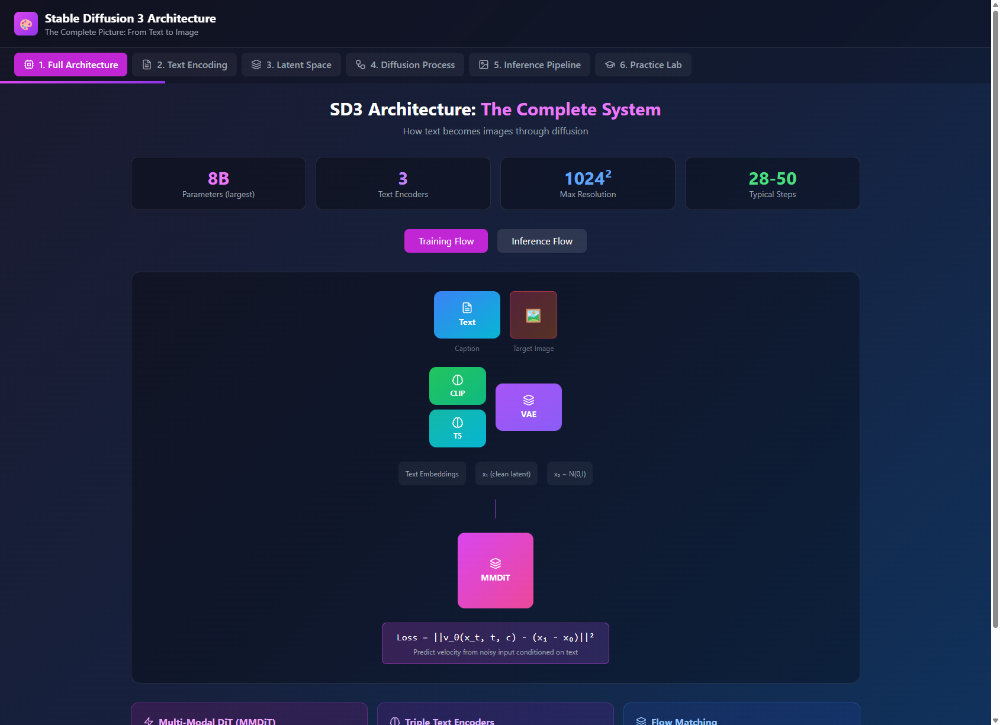
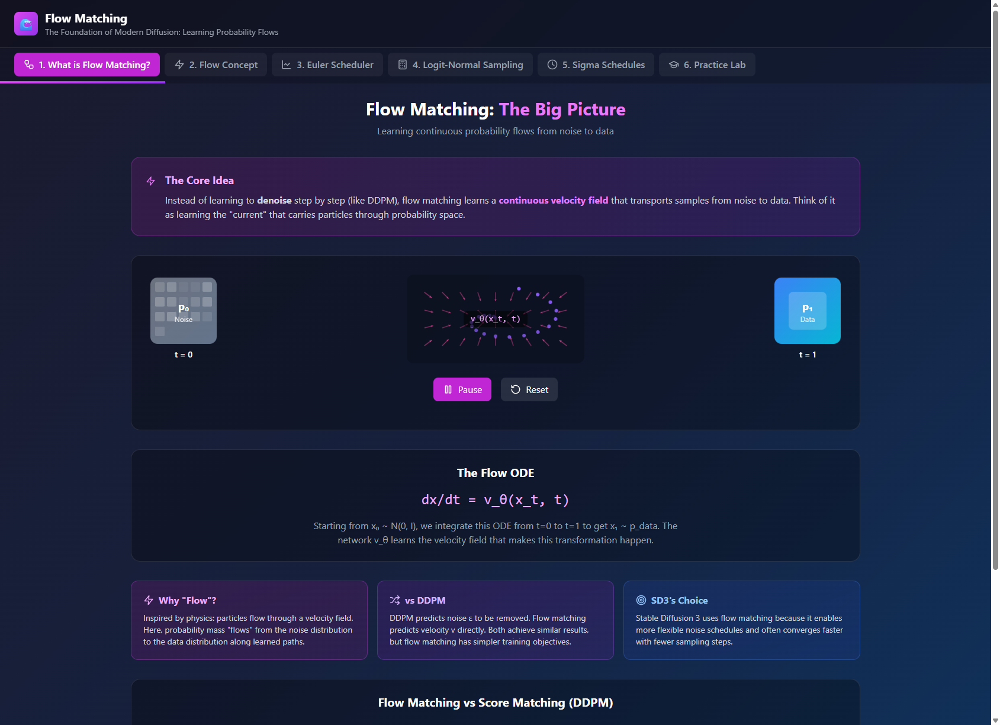
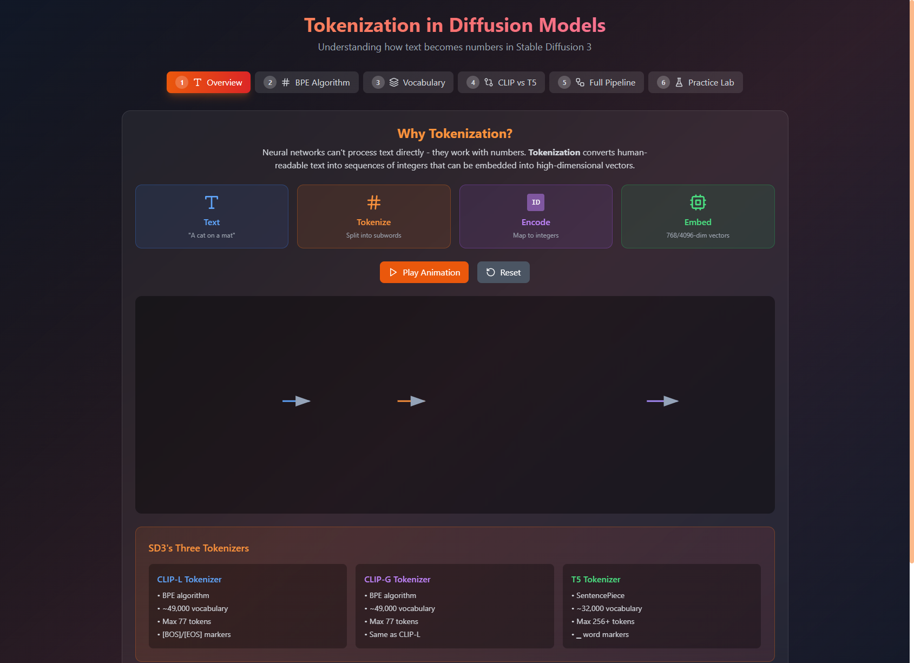

# ML Animations

Interactive visualizations of Machine Learning and Linear Algebra concepts, built with React, Three.js, and GSAP.


## 🚀 Unified Application

All animations are now available in a single unified React application with:
- 🎨 Consistent design system
- 🌓 Dark/Light mode toggle
- 📱 Responsive sidebar navigation
- ⚡ Lazy loading for performance

```bash
cd unified-app
npm install
npm run dev
```

---

## 📚 Table of Contents

- [Natural Language Processing](#natural-language-processing)
- [Transformers & Attention](#transformers--attention)
- [Neural Networks](#neural-networks)
- [Advanced Models](#advanced-models)
- [Diffusion Models](#diffusion-models)
- [Math Fundamentals](#math-fundamentals)
- [Probability & Statistics](#probability--statistics)
- [Reinforcement Learning](#reinforcement-learning)
- [Algorithms & Data Structures](#algorithms--data-structures)
- [Information Theory](#information-theory)
- [Mini Diffusion (Rust)](#mini-diffusion-rust-implementation)
- [Mini-Diffusion (Multi-Language)](#mini-diffusion-multi-language-implementation)
- [Mini-NN (Multi-Language)](#mini-nn-multi-language-implementation)
- [Mini Markov (Multi-Language)](#mini-markov-multi-language-implementation)
- [Neural Network Animation](#neural-network-animation)

---

## Natural Language Processing

### Bag of Words Animation

A foundational NLP concept showing how text is converted to numerical vectors.


- **Visualizes:** Text → Word Frequency Vectors
- **Features:**
  - Interactive document input
  - Vocabulary building visualization
  - Vector representation display
  - Similarity calculations between documents

```bash
cd bag-of-words-animation && npm install && npm run dev
```

### Word2Vec Animation

Understanding word embeddings through the Skip-gram and CBOW models.


- **Visualizes:** Words → Dense Vector Space
- **3 Learning Modes:**
  1. **📖 Concept**: Understanding context windows and word relationships
  2. **🎯 Skip-gram**: Predicting context words from center word
  3. **🔄 CBOW**: Predicting center word from context
- **Features:**
  - Interactive training visualization
  - 2D/3D embedding space exploration
  - Analogy demonstrations (King - Man + Woman = Queen)

```bash
cd word2vec-animation && npm install && npm run dev
```

### GloVe Animation

Global Vectors for Word Representation - learning from co-occurrence statistics.


- **Visualizes:** Co-occurrence Matrix → Word Vectors
- **Features:**
  - Co-occurrence matrix construction
  - Objective function visualization
  - Comparison with Word2Vec approach
  - Interactive embedding exploration

```bash
cd glove-animation && npm install && npm run dev
```

### FastText Animation

Subword embeddings for handling rare and out-of-vocabulary words.


- **Visualizes:** Words → Character n-grams → Embeddings
- **Features:**
  - Subword decomposition visualization
  - OOV word handling demonstration
  - Morphologically rich language support
  - Comparison with Word2Vec

```bash
cd fasttext-animation && npm install && npm run dev
```

### Tokenization Animation

Breaking text into tokens - the first step in NLP pipelines.


- **Visualizes:** Text → Tokens → IDs
- **3 Learning Modes:**
- **Visualizes:** Query-Key-Value attention mechanism
- **3 Learning Modes:**
  1. **📚 Library Search**: Intuitive analogy for Q, K, V
  2. **🌍 Translation**: Attention in sequence-to-sequence models
  3. **💬 Conversation**: Context-aware attention

  1. **🔑 The Concept**: Intuitive "Library" analogy for Query, Key, and Value
  2. **🧮 The Mechanism**: Step-by-step visualization of the math
  3. **🕸️ Playground**: Interactive text attention visualization (Coreference Resolution)
- **Features:**
  - Interactive Q/K/V matching
  - Matrix multiplication visualization
  - Real-time attention heatmaps for text

```bash
cd self-attention-animation && npm install && npm run dev
```

### BERT Animation

Bidirectional Encoder Representations from Transformers.


- **Visualizes:** Pre-training objectives and fine-tuning
- **3 Learning Modes:**
  1. **🎭 Masked Language Model (MLM)**: Predicting masked tokens
  2. **📝 Next Sentence Prediction (NSP)**: Understanding sentence relationships
  3. **🔧 Fine-tuning**: Adapting BERT for downstream tasks
- **Features:**
  - Token embedding visualization
  - Attention pattern exploration
  - Interactive masking playground

```bash
cd bert-animation && npm install && npm run dev
```

### Transformer Animation

The complete Transformer architecture - "Attention Is All You Need".


- **Visualizes:** Encoder-Decoder architecture
- **4 Learning Modes:**
  1. **🏗️ Architecture Overview**: High-level component breakdown
  2. **🔄 Encoder Stack**: Multi-head attention and feed-forward layers
  3. **📤 Decoder Stack**: Masked attention and cross-attention
  4. **🎬 Full Forward Pass**: End-to-end sequence transformation
- **Features:**
  - Layer-by-layer visualization
  - Residual connections and layer normalization
  - Interactive token flow

```bash
cd transformer-animation && npm install && npm run dev
```

### Positional Encoding Animation

How Transformers understand word order.


- **Visualizes:** Position information in sequences
- **3 Learning Modes:**
  1. **🔀 The Problem**: Demonstrate why "Dog bites man" ≠ "Man bites dog"
  2. **🌊 Sinusoidal Encoding**: Visualize the wave patterns that encode position
  3. **🎮 Encoding Playground**: Compare Sinusoidal vs. Learned vs. Integer encoding
- **Features:**
  - Interactive sentence comparison
  - Waveform visualization with multiple frequencies

```bash
cd positional-encoding-animation && npm install && npm run dev
```

---

## Neural Networks

### ReLU Activation Animation

A visual explanation of the ReLU (Rectified Linear Unit) activation function.


- **Visualizes:** z = W·X + b → ReLU(z) = max(0, z)
- **Features:**
  - Step-by-step animation showing dot product, bias addition, and ReLU application
  - Interactive ReLU graph visualization synchronized with steps
  - Practice mode with randomly generated problems
  - Formula reference and hints
  - Built with Three.js for 3D rendering

```bash
cd relu-animation && npm install && npm run dev
```

### Leaky ReLU Activation Animation

A visual explanation of the Leaky ReLU activation function.


- **Visualizes:** z = W·X + b → Leaky ReLU(z) = z if z > 0, else α×z
- **Features:**
  - Step-by-step animation showing dot product, bias addition, and Leaky ReLU application
  - Interactive Leaky ReLU graph visualization with reference line
  - Practice mode with randomly generated problems
  - α (alpha) parameter visualization (default: 0.01)

```bash
cd leaky-relu-animation && npm install && npm run dev
```

### Softmax Animation

Converting logits to probabilities for classification.


- **Visualizes:** e^(xi) / Σe^(xj) → Probability Distribution
- **3 Learning Modes:**
  1. **📊 The Math**: Step-by-step calculation breakdown
  2. **🌡️ Temperature Scaling**: How temperature affects sharpness
  3. **🎯 Classification**: Real-world application in neural networks
- **Features:**
  - Interactive logit adjustment
  - Probability distribution visualization
  - Temperature parameter exploration

```bash
cd softmax-animation && npm install && npm run dev
```

### LSTM Animation (Deep Dive)

A "Bit-by-Bit" interactive guide to Long Short-Term Memory networks.


- **4-Mode Learning System:**
  1. **📚 The Conveyor Belt**: Intuitive analogy for cell state flow
  2. **🔬 Anatomy Lab**: Interactive component explorer (Sigmoid, Tanh, Gates)
  3. **🎬 Bit-by-Bit Flow**: Granular 8-step animation of a single time step
  4. **🔁 Sequence View**: Visualization of LSTM unrolled over time

```bash
cd lstm-animation && npm install && npm run dev
```

### 2D Convolution Animation

A visual guide to 2D convolution operations used in CNNs.


- **Visualizes:** Input (5×5) ∗ Kernel (3×3) = Output (3×3)
- **Features:**
  - Animated kernel sliding across input matrix
  - Real-time element-wise multiplication and summation display
  - Color-coded highlighting showing kernel position
  - Practice mode with different kernel types (edge detection, sharpen, blur)

```bash
cd conv2d-animation && npm install && npm run dev
```

### Multi-Input Neural Network (Conv + ReLU)

A visual demonstration of a two-layer neural network with three inputs and ReLU activations.


- **Visualizes:** X × W₁ → ReLU → A₁ × W₂ → ReLU → Output
- **Features:**
  - Two-layer feedforward network with matrix multiplication
  - Step-by-step animation showing forward propagation
  - Clear visualization of pre-activation (Z) and post-activation (A) values
  - Practice mode with randomly generated matrix problems

```bash
cd conv-relu-animation && npm install && npm run dev
```

### Layer Normalization Animation

Stabilizing deep network training.


- **3 Learning Modes:**
  1. **📊 The Problem**: Visualize activation drift and gradient instability
  2. **⚖️ Layer Norm vs Batch Norm**: Compare normalization across different axes
  3. **🔄 Residual Connections**: Demonstrate the "Add & Norm" pattern in Transformers
- **Features:**
  - Activation distribution visualization
  - Interactive batch size adjustment
  - Gradient flow demonstration

```bash
cd layer-normalization-animation && npm install && npm run dev
```

---

## Advanced Models

### VAE Animation (Variational Autoencoder)

Understanding generative models through the lens of variational inference.


- **Visualizes:** Encoder → Latent Space → Decoder
- **3 Learning Modes:**
  1. **🔄 Autoencoder Basics**: Compression and reconstruction
  2. **📊 The Latent Space**: Continuous latent representation
  3. **🎲 Sampling & Generation**: Reparameterization trick
- **Features:**
  - Interactive latent space exploration
  - KL divergence visualization
  - Image generation playground

```bash
cd vae-animation && npm install && npm run dev
```

### RAG Animation (Retrieval-Augmented Generation)

Enhancing LLMs with external knowledge retrieval.


- **Visualizes:** Query → Retrieve → Augment → Generate
- **3 Learning Modes:**
  1. **📚 The Pipeline**: Understanding RAG architecture
  2. **🔍 Retrieval**: Vector similarity search
  3. **✨ Generation**: Augmented context for LLM
- **Features:**
  - Document embedding visualization
  - Relevance scoring demonstration
  - Interactive query playground

```bash
cd rag-animation && npm install && npm run dev
```

### Multimodal LLM Animation

Understanding models that process multiple modalities (text, images, audio).


- **Visualizes:** Multi-modal input processing and fusion
- **Features:**
  - Vision encoder architecture
  - Cross-modal attention mechanisms
  - Token embedding visualization
  - Interactive multimodal queries

```bash
cd multimodal-llm-animation && npm install && npm run dev
```

### Fine-tuning Animation

Adapting pre-trained models for specific tasks.


- **Visualizes:** Pre-trained → Fine-tuned model transformation
- **3 Learning Modes:**
  1. **🎯 Full Fine-tuning**: Updating all parameters
  2. **❄️ Freeze & Train**: Selective layer training
  3. **🔌 LoRA/Adapters**: Parameter-efficient fine-tuning
- **Features:**
  - Layer-wise training visualization
  - Learning rate strategies
  - Catastrophic forgetting demonstration

```bash
cd fine-tuning-animation && npm install && npm run dev
```

---

## Diffusion Models

Interactive animations explaining Stable Diffusion 3 and Flux-style diffusion models.

### SD3 Overview Animation

Understanding the complete SD3 architecture and how all components work together.



- **Visualizes:** Text → CLIP/T5 → DiT → VAE Decoder → Image
- **Features:**
  - Complete pipeline overview
  - Component interactions
  - Data flow visualization

```bash
cd sd3-overview-animation && npm install && npm run dev
```

### Flow Matching Animation

Modern training approach used in SD3 and Flux.



- **Visualizes:** ODE-based generation paths
- **Features:**
  - Rectified Flow concepts
  - Euler solver stepping
  - Logit-normal timestep sampling

```bash
cd flow-matching-animation && npm install && npm run dev
```

### DiT Transformer Animation

Diffusion Transformer - replacing U-Net with transformers.
  - Attention pattern visualization

```bash
cd joint-attention-animation && npm install && npm run dev
```

### CLIP Text Encoder Animation

CLIP encoder for visual concept understanding.

- **Visualizes:** Text → BPE Tokenization → Transformer → Embeddings
- **Features:**
  - 12-layer transformer architecture
  - Causal attention masking
  - Pooled embedding extraction

```bash
cd clip-text-encoder-animation && npm install && npm run dev
```

### T5 Text Encoder Animation

T5-XXL encoder for detailed text understanding.

- **Visualizes:** Text → SentencePiece → Bidirectional Encoder
- **Features:**
  - 24-layer encoder architecture
  - Relative position bias
  - RMSNorm vs LayerNorm

```bash
cd t5-text-encoder-animation && npm install && npm run dev
```

### Diffusion Tokenizer Animation

Understanding tokenization for diffusion models.



- **Visualizes:** BPE and SentencePiece tokenization
- **Features:**
  - CLIP vs T5 tokenizer comparison
  - Vocabulary structure
  - Word boundary markers

```bash
cd diffusion-tokenizer-animation && npm install && npm run dev
```

---

## Math Fundamentals

### Matrix Multiplication Animation

A step-by-step visual guide to matrix multiplication.


- **Visualizes:** Matrix A (2x2) × Matrix B (2x3) = Matrix C (2x3)
- **Features:**
  - Step-by-step animation of row-column dot products
  - Color-coded highlighting of active rows and columns
  - Interactive controls (Play, Reset, Next/Prev Step)
  - Practice mode with different matrices
  - Built with Three.js for 3D rendering

```bash
cd matrix-multiplication-animation && npm install && npm run dev
```

### SVD Animation

A comprehensive visualization of Singular Value Decomposition.


- **Visualizes:** A (m×n) = U (m×m) × Σ (m×n) × V^T (n×n)
- **Features:**
  - Step-by-step SVD decomposition animation (9 steps)
  - Shows U (left singular vectors), Σ (singular values), V^T (right singular vectors)
  - Visualizes reconstruction: A = UΣV^T
  - Practice mode with exercises
  - Educational info on ML applications (PCA, compression)

```bash
cd svd-animation && npm install && npm run dev
```

### Eigenvalue Decomposition Animation ✨

A comprehensive learning system teaching eigenvalues from first principles.


- **Visualizes:** A = Q Λ Q^T (for symmetric A)
- **5 Learning Modes:**
  1. **📚 Tutorial Mode**: 7-step conceptual learning
  2. **🌐 Geometric Visualizer**: Circle → ellipse transformation
  3. **🎮 Interactive Explorer**: Drag vectors to see transformation
  4. **🎬 Matrix Decomposition**: Step-by-step A = QΛQ^T animation
  5. **✏️ Practice Exercises**: Interactive problems with hints

```bash
cd eigenvalue-animation && npm install && npm run dev
```

### QR Decomposition Animation

A demonstration of QR decomposition using the Gram-Schmidt process.


- **Visualizes:** A = Q × R (orthonormal Q, upper triangular R)
- **Features:**
  - Step-by-step Gram-Schmidt orthogonalization (6 steps)
  - Shows transformation of matrix columns into orthonormal basis
  - Visualizes Q (orthonormal columns) and R (upper triangular)
  - Practice mode with QR decomposition exercises

```bash
cd qr-decomposition-animation && npm install && npm run dev
```

### Gradient Descent Animation

A step-by-step guide to the "Learning Process" of neural networks.


- **4 Learning Modes:**
  1. **🏔️ The Hiker**: Intuitive analogy of a hiker in the fog
  2. **📉 2D Slope Lab**: Connecting the hiker to the math (dy/dx)
  3. **🏞️ 3D Landscape**: Exploring complex terrain with local minima
  4. **🎛️ Tuning Studio**: Experimenting with Learning Rates
- **Features:**
  - Interactive 3D visualization with Three.js
  - Learning rate comparison

```bash
cd gradient-descent-animation && npm install && npm run dev
```

### Linear Regression Animation

Finding the line of best fit.


- **3 Learning Modes:**
  1. **📏 The Residuals**: Manually drag the line to minimize error squares
  2. **✍️ Interactive Fitter**: Click to add points, see OLS formula update
  3. **🥣 The Cost Landscape**: Visualize MSE as a 3D surface bowl
- **Features:**
  - Interactive point manipulation
  - Real-time coefficient updates

```bash
cd linear-regression-animation && npm install && npm run dev
```

### Embeddings Animation

Where words become geometry.


- **3 Learning Modes:**
  1. **🧮 Word Algebra**: Visualizing "King - Man + Woman = Queen"
  2. **📐 Similarity Lab**: Interactive Cosine Similarity calculator
  3. **🌌 3D Semantic Space**: Fly through a galaxy of word clusters
- **Features:**
  - Vector arithmetic visualization
  - 3D Point Cloud with Three.js

```bash
cd embeddings-animation && npm install && npm run dev
```

### Cosine Similarity Animation

The math behind recommendations and search.


- **3 Learning Modes:**
  1. **✖️ The Dot Product**: Visualizing projections
  2. **🎬 Movie Matcher**: Build a recommender system
  3. **🔍 Search Engine**: Rank documents by relevance
- **Features:**
  - Interactive vector manipulation
  - Radar charts for multi-dimensional comparison

```bash
cd cosine-similarity-animation && npm install && npm run dev
```

---

## Probability & Statistics

### Conditional Probability & Bayes' Theorem Animation

Updating beliefs with evidence.


- **3 Learning Modes:**
### Probability Distributions Animation

Modeling randomness with mathematics.


- **3 Learning Modes:**
  1. **🎲 Discrete Distributions**: Binomial and Poisson
  2. **📊 Continuous Distributions**: Normal and Exponential
  3. **⚖️ PMF vs PDF**: Understanding the critical difference
- **Features:**
  - Interactive parameter sliders
  - Real-time distribution visualization
  - Area under curve calculation

```bash
cd probability-distributions-animation && npm install && npm run dev
```

### Expected Value & Variance Animation

Quantifying center and spread.


- **3 Learning Modes:**
  1. **⚖️ Expected Value**: Visualize E[X] as the "balance point"
  2. **📏 Variance**: Compare narrow vs wide distributions
  3. **🎰 Decision Making**: Apply to investment choices
- **Features:**
  - Balance beam visualization for E[X]
  - Deviation visualization for variance
  - Risk-adjusted decision making

```bash
cd expected-value-variance-animation && npm install && npm run dev
```

### Markov Chains Animation

The engine behind PageRank and Text Generation.


- **4 Learning Modes:**
  1. **🐸 The Markov Property**: Frog simulator demonstrating memorylessness
  2. **🕸️ Transition Matrix**: Interactive graph-to-matrix builder
  3. **⚖️ Stationary Distribution**: Visualizing convergence
  4. **📝 Text Generation**: Mini-LLM using bigram models
- **Features:**
  - Animated simulations
  - Real-time matrix updates
  - Text generation playground

```bash
cd markov-chains-animation && npm install && npm run dev
```

### Spearman Correlation Animation

An interactive exploration of Rank Correlation and Robustness.


- **3 Learning Modes:**
  1. **💡 Concept**: Raw Space (curved) to Rank Space (linear)
  2. **🧮 Calculation Lab**: Step-by-step animated table
  3. **⚖️ Robustness**: Interactive outlier sensitivity (Pearson vs. Spearman)

```bash
cd spearman-correlation-animation && npm install && npm run dev
```

---

## Reinforcement Learning

### Part 1: RL Foundations

The building blocks of Reinforcement Learning.


- **3 Learning Modes:**
  1. **🤖 The Agent**: Manual Gridworld to understand State-Action-Reward loops
  2. **💎 Rewards**: Design level rewards and analyze path returns
  3. **📉 Discounted Returns**: Visualize how Gamma affects long-term planning
- **Features:**
  - Playable Gridworld
  - Level Editor
  - Interactive Discount Factor visualization

```bash
cd rl-foundations-animation && npm install && npm run dev
```

### Part 2: Q-Learning Algorithm

The core algorithm where the agent learns from experience.


- **3 Learning Modes:**
  1. **📊 The Q-Table**: Visualize the agent's brain (State-Action Values)
  2. **🧮 The Bellman Update**: Step-by-step math visualization
  3. **🏋️ Training Loop**: Watch the agent master the maze
- **Features:**
  - Interactive Q-Table inspection
  - Real-time training graphs
  - Adjustable learning parameters

```bash
cd q-learning-animation && npm install && npm run dev
```

### Part 3: Exploration & Optimization

Mastering the trade-offs in Reinforcement Learning.


- **3 Learning Modes:**
  1. **🎲 Epsilon-Greedy**: Visualize Explore vs Exploit
  2. **🧗 The Cliff**: Risk vs Reward - why optimal isn't always safe
  3. **🎛️ Hyperparameters**: Interactive tuning lab for Alpha and Gamma
- **Features:**
  - Live exploration stats
  - Cliff walking simulation
  - Learning curve projections

```bash
cd rl-exploration-animation && npm install && npm run dev
```

---

## Algorithms & Data Structures

### Bloom Filter Animation

A probabilistic data structure explorer.


- **3 Learning Modes:**
  1. **🎮 Playground**: Interactive visualizer to Add and Check items
  2. **⚠️ False Positive Lab**: Create collisions to understand "Probably Yes"
  3. **🎛️ Tuning Studio**: Find the optimal k (hash functions)

```bash
cd bloom-filter-animation && npm install && npm run dev
```

### PageRank Animation

The algorithm that built Google.


- **3 Learning Modes:**
  1. **🕸️ Graph Builder**: Build your own "Mini-Internet"
  2. **🏄 Random Surfer**: Monte Carlo simulation visualization
  3. **👑 Power Method**: Watch "Rank Juice" flow to steady state

```bash
cd pagerank-animation && npm install && npm run dev
```

---

## Information Theory

### Part 1: Entropy & Information
### Part 2: Cross-Entropy & KL Divergence

The bridge between Probability and Machine Learning optimization.


## Mini Diffusion (Rust Implementation)

A complete diffusion model implementation in Rust, built from scratch for educational purposes. This demonstrates the core concepts of modern diffusion models (like SD3 and Flux) while teaching Rust programming patterns.

### Features

| Component | Description | Status |
|-----------|-------------|--------|
| Tensor | Multi-dim arrays, math ops | ✅ Working |
| U-Net | Encoder-decoder with skips | ✅ Working |
| DDPM/DDIM Sampling | Stochastic & deterministic | ✅ Working |
| BPE/Unigram Tokenizers | CLIP & T5 style | ✅ Working |
| Flow Matching | SD3-style training | ✅ Working |
| VAE/DiT/Joint Attention | Architecture structures | ⚠️ Structure |

### Quick Start

```bash
cd mini-diffusion

# Build
cargo build --release

# Run demos
cargo run --bin generate --release   # Generate images (random weights)
cargo run --bin train --release      # Training structure demo
cargo run --bin demo_sd3 --release   # SD3 components demo

# Run tests
cargo test
```

### Rust Concepts Demonstrated

- **Ownership & Borrowing**: Memory-safe tensor operations
- **Traits**: Common interfaces for layers and modules  
- **Builder Pattern**: Configuration structs
- **Error Handling**: Result types for shape mismatches
- **Type Safety**: Compile-time dimension checking

See [mini-diffusion/README.md](mini-diffusion/README.md) for full documentation.

---

## Mini-Diffusion (Multi-Language Implementation)

Diffusion model implementations from scratch in **Rust**, **Go**, **Java**, and **Python** - demonstrating DDPM/DDIM concepts across languages.

### 🎯 Features

All implementations provide:
- ✅ 4D Tensor operations [batch, channels, height, width]
- ✅ Noise schedulers (linear, cosine, quadratic beta schedules)
- ✅ Neural network layers: Linear, Conv2d, GroupNorm
- ✅ U-Net architecture with residual blocks and skip connections
- ✅ Sinusoidal timestep embeddings
- ✅ DDPM sampling (stochastic)
- ✅ DDIM sampling (deterministic)

### 📊 Verified Results

#### Noise Schedule Comparison (1000 timesteps)

| Schedule | α̅₀ | α̅₅₀₀ | α̅₉₉₉ |
|----------|-----|-------|-------|
| Linear | 0.9999 | 0.0078 | 0.00004 |
| Cosine | 0.9999 | 0.4923 | 0.00000 |
| Quadratic | 0.9999 | 0.3313 | 0.00073 |

#### U-Net Architecture (model_channels=32)

| Component | Parameters |
|-----------|------------|
| Input Conv | 896 |
| Time MLP | 16,896 |
| Encoder | ~100K |
| Middle | ~50K |
| Decoder | ~200K |
| **Total** | **~450K** |

### 🚀 Quick Start

**Rust** (original):
```bash
cd mini-diffusion
cargo build --release
cargo run --bin generate --release   # Generate images (random weights)
cargo run --bin demo_sd3 --release   # SD3 components demo
```

**Python** (verified working):
```bash
cd mini-diffusion-python
pip install numpy
python -m mini_diffusion.demo
```

**Go**:
```bash
cd mini-diffusion-go
go mod download
go run ./cmd/demo
```

**Java** (requires JDK 8+):
```bash
cd mini-diffusion-java
mvn compile
mvn exec:java -Dexec.mainClass="com.minidiffusion.Demo"
```

### 📁 Project Structure

| Language | Directory | Matrix Lib | Core Files |
|----------|-----------|------------|------------|
| Rust | `mini-diffusion/` | ndarray | `tensor.rs`, `nn.rs`, `diffusion.rs`, `unet.rs` |
| Go | `mini-diffusion-go/` | gonum | `diffusion/*.go` |
| Java | `mini-diffusion-java/` | Custom | `com/minidiffusion/*.java` |
| Python | `mini-diffusion-python/` | NumPy | `mini_diffusion/*.py` |

### 📖 Documentation

- [mini-diffusion/README.md](mini-diffusion/README.md) - Rust implementation (full SD3/Flux architecture)
- [mini-diffusion-go/README.md](mini-diffusion-go/README.md) - Go implementation
- [mini-diffusion-java/README.md](mini-diffusion-java/README.md) - Java implementation
- [mini-diffusion-python/README.md](mini-diffusion-python/README.md) - Python implementation

---

## Mini-NN (Multi-Language Implementation)

Neural network implementations from scratch in **Rust**, **Go**, **Java**, and **Python** - demonstrating backpropagation and gradient descent across languages.

### 🎯 Features

All implementations provide:
- ✅ Tensor operations (matrix multiply, transpose, element-wise ops)
- ✅ Activations: ReLU, LeakyReLU, Sigmoid, Tanh, Softmax
- ✅ Loss functions: MSE, Binary Cross-Entropy, Cross-Entropy
- ✅ Dense (fully connected) layers with Xavier/He initialization
- ✅ Optimizers: SGD, SGD with Momentum, Adam
- ✅ Mini-batch training with validation split and early stopping

### 📊 Verified Results (Consistent Across All Languages)

#### XOR Classification (All Languages)

| Input | Expected | Rust | Go | Java | Python |
|-------|----------|------|----|----- |--------|
| [0, 0] | 0 | ✅ 0 | ✅ 0 | ✅ 0 | ✅ 0 |
| [0, 1] | 1 | ✅ 1 | ✅ 1 | ✅ 1 | ✅ 1 |
| [1, 0] | 1 | ✅ 1 | ✅ 1 | ✅ 1 | ✅ 1 |
| [1, 1] | 0 | ✅ 0 | ✅ 0 | ✅ 0 | ✅ 0 |
| **Accuracy** | 100% | **100%** | **100%** | **100%** | **100%** |

#### Titanic Survival Prediction (Rust Benchmark)

| Method | Accuracy |
|--------|----------|
| Logistic Regression | ~77% |
| Random Forest | ~78% |
| Gradient Boosting | ~80% |
| sklearn Neural Network | ~79% |
| Top Kaggle Submissions | ~83% |
| **Our Mini-NN (Rust)** | **84.3%** ✨ |

### 🚀 Quick Start

**Rust** (original):
```bash
cd mini-nn
cargo build --release
cargo run --bin demo_xor --release       # XOR (100%)
cargo run --bin train_titanic --release  # Titanic (84.3%)
```

**Python** (verified 100% XOR):
```bash
cd mini-nn-python
pip install numpy
python demo_xor.py
```

**Go**:
```bash
cd mini-nn-go
go mod download
go run ./cmd/demo_xor
```

**Java** (requires JDK 8+):
```bash
cd mini-nn-java
mvn compile
mvn exec:java -Dexec.mainClass="com.mininn.DemoXOR"
```

### 📁 Project Structure

| Language | Directory | Matrix Lib | Core Files |
|----------|-----------|------------|------------|
| Rust | `mini-nn/` | ndarray | `tensor.rs`, `layer.rs`, `network.rs` |
| Go | `mini-nn-go/` | gonum | `nn/*.go` |
| Java | `mini-nn-java/` | Custom | `com/mininn/*.java` |
| Python | `mini-nn-python/` | NumPy | `mini_nn/*.py` |

### 📖 Documentation

- [mini-nn/README.md](mini-nn/README.md) - Rust implementation
- [mini-nn-go/README.md](mini-nn-go/README.md) - Go implementation
- [mini-nn-java/README.md](mini-nn-java/README.md) - Java implementation
- [mini-nn-python/README.md](mini-nn-python/README.md) - Python implementation

---

## Mini Markov (Multi-Language Implementation)

Markov Chain implementations from scratch in **Rust**, **Go**, **Java**, and **Python** - demonstrating the same algorithms across languages.

### 🎯 Features

All implementations provide:
- ✅ Generic Markov chain with configurable n-gram order
- ✅ Text generation (word-level and character-level)
- ✅ State machine modeling
- ✅ Stationary distribution calculation (power iteration)
- ✅ Entropy measurement
- ✅ Demo applications (text, weather, music)

### 📊 Verified Results (Consistent Across All Languages)

#### Weather Model Stationary Distribution

Using transition probabilities:
- Sunny → Sunny: 70%, Cloudy: 20%, Rainy: 10%
- Cloudy → Sunny: 30%, Cloudy: 40%, Rainy: 30%
- Rainy → Sunny: 20%, Cloudy: 40%, Rainy: 40%

| State | Stationary Probability |
|-------|------------------------|
| ☀️ Sunny | **46.2%** |
| ☁️ Cloudy | **30.8%** |
| 🌧️ Rainy | **23.1%** |

#### Pop Music Chord Progression Distribution

Trained on common progressions (I-V-vi-IV, I-IV-V-IV, vi-IV-I-V):

| Chord | Frequency |
|-------|----------|
| IV | ~36% |
| V | ~30% |
| vi | ~17% |
| I | ~17% |

#### Text Generation Entropy

| N-gram Order | Entropy | Behavior |
|--------------|---------|----------|
| Order 1 (unigram) | ~1.3 bits | More random, creative |
| Order 2 (bigram) | ~0.2 bits | More coherent |
| Order 3+ | <0.15 bits | Near-deterministic |

### 🚀 Quick Start

**Rust** (original):
```bash
cd mini-markov
cargo test                            # 13 tests passing
cargo run --bin demo_weather --release
```

**Python** (8/8 tests passing):
```bash
cd mini-markov-python
pip install -e ".[dev]"
pytest tests/ -v
python -m mini_markov.demo_weather
python -m mini_markov.demo_text
python -m mini_markov.demo_music
```

**Go**:
```bash
cd mini-markov-go
go test ./...
go run ./cmd/demo_weather
```

**Java** (requires JDK 8+):
```bash
cd mini-markov-java
mvn test
mvn exec:java -Dexec.mainClass="com.minimarkov.demo.DemoWeather"
```

### 📁 Project Structure

| Language | Directory | Core Files |
|----------|-----------|------------|
| Rust | `mini-markov/` | `chain.rs`, `text.rs`, `state.rs` |
| Go | `mini-markov-go/` | `markov/chain.go`, `markov/text.go`, `markov/state.go` |
| Java | `mini-markov-java/` | `MarkovChain.java`, `TextGenerator.java`, `StateChain.java` |
| Python | `mini-markov-python/` | `chain.py`, `text.py`, `state.py` |

### 📖 Documentation

- [mini-markov/README.md](mini-markov/README.md) - Rust implementation
- [mini-markov-go/README.md](mini-markov-go/README.md) - Go implementation
- [mini-markov-java/README.md](mini-markov-java/README.md) - Java implementation
- [mini-markov-python/README.md](mini-markov-python/README.md) - Python implementation

---

## Neural Network Animation

Interactive visualization of forward and backward propagation through a neural network.


- **Visualizes:** Forward propagation, backpropagation, gradient descent
- **Features:**
  - Step-by-step forward pass with activation values
  - Backward propagation with gradient visualization
  - XOR problem demonstration
  - Weight update visualization
  - Mathematical formulas displayed

```bash
cd neural-network-animation && npm install && npm run dev
```

---

## Technologies Used

- **React**: UI and state management
- **Three.js**: 3D graphics rendering
- **GSAP**: Smooth animations
- **Vite**: Fast build tool and development server
- **Tailwind CSS**: Styling
- **Rust**: Mini-Diffusion, Mini-NN, Mini-Markov implementations (ndarray, image crates)
- **Go**: Mini-NN, Mini-Markov implementations (gonum)
- **Java**: Mini-NN, Mini-Markov implementations (Maven)
- **Python**: Mini-NN, Mini-Markov implementations (NumPy)

## Contributing

1. Fork the repository
2. Create a feature branch
3. Add your animation following the existing pattern
4. Submit a pull request

## License

MIT License - See LICENSE file for details
