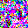

# Mini Diffusion

A minimal diffusion model implementation in Rust, built from scratch for educational purposes.

This project demonstrates the core concepts of modern diffusion models (like Stable Diffusion 3 and Flux) while teaching Rust programming patterns.



## 📋 Table of Contents

- [Educational Goals](#-educational-goals)
- [Project Structure](#-project-structure)
- [Quick Start](#-quick-start)
- [Module Deep Dive](#-module-deep-dive)
- [Rust Concepts Explained](#-rust-concepts-explained)
- [Architecture Overview](#-architecture-overview)
- [Configuration](#-configuration)
- [Implementation Status](#-whats-implemented)
- [Learning Resources](#-learning-resources)

## 🎯 Educational Goals

This project serves two purposes:

1. **Learn Diffusion Models**: Understand tensors, neural networks, noise schedules, and sampling algorithms
2. **Learn Rust**: See how ML concepts translate to Rust's ownership model, traits, and performance

## 🏗️ Project Structure

```
mini-diffusion/
├── Cargo.toml           # Dependencies and project config
├── src/
│   ├── lib.rs           # Library exports
│   ├── tensor.rs        # Tensor implementation (ndarray wrapper)
│   ├── nn.rs            # Neural network layers (Linear, Conv2d, etc.)
│   ├── diffusion.rs     # Noise schedules and forward diffusion
│   ├── unet.rs          # U-Net architecture (DDPM-style)
│   ├── training.rs      # Training loop and optimizer
│   ├── sampling.rs      # DDPM/DDIM sampling
│   ├── vae.rs           # Variational Autoencoder
│   ├── tokenizer.rs     # BPE and Unigram tokenizers
│   ├── clip.rs          # CLIP text encoder
│   ├── t5.rs            # T5 text encoder
│   ├── flow.rs          # Flow matching (SD3-style)
│   ├── joint_attention.rs # Multi-modal attention
│   ├── dit.rs           # Diffusion Transformer
│   └── bin/
│       ├── train.rs     # Training demo
│       ├── generate.rs  # Generation demo  
│       └── demo_sd3.rs  # SD3 components demo
```

## 🚀 Quick Start

### Prerequisites

- Rust 1.70+ (install from [rustup.rs](https://rustup.rs))

### Build

```bash
cd mini-diffusion
cargo build --release
```

### Run Tests

```bash
# Run all tests
cargo test

# Run tests with output
cargo test -- --nocapture
```

### Run Demos

```bash
# Generate images with random weights (shows pipeline works)
cargo run --bin generate --release

# Training demo (shows structure, not real training)
cargo run --bin train --release

# SD3 components demo (tokenizers, flow matching, tensors)
cargo run --bin demo_sd3 --release
```

### Example Output

**Generate Demo:**
```
Mini Diffusion - Image Generation
==================================

Sampler Configuration:
  - Steps: 50 (out of 1000 training steps)
  - Method: DDIM
  - Eta: 0

Creating model...
  - Parameters: 9572931

Note: Model has random weights (no training)
      Output will look like colored noise.

Generating 4 images of size 32x32...
  DDIM Sampling: [████████████████████████████████████████] 50/50
Generation complete!
  - Output shape: [4, 3, 32, 32]
  - Value range: [-1.000, 1.000]

Saving images...
Saved: generated_0.png
Images saved successfully!
```

**SD3 Demo:**
```
=== Mini-Diffusion: SD3-Style Components Demo ===

--- BPE Tokenizer (CLIP-style) ---
Input: "a photo of a cat"
Tokens: [0, 3, 116, 108, 115, 120, 3, 115, 3, 3, 103, 101, 3, 1]
Vocab size: 260

--- Unigram Tokenizer (T5-style) ---
Input: "a photo of a cat"
Tokens: [70, 56, 68, 70, 60, 2]
Decoded: "a photo of a cat"

--- Flow Matching Scheduler ---
Number of inference steps: 20
Sigma schedule (first 5): [1.0, 0.95, 0.9, 0.85, 0.8]

✅ All component demos completed successfully!
```

## 📚 Module Deep Dive

### `tensor.rs` - The Foundation

Everything in ML starts with tensors. Our implementation wraps `ndarray`:

```rust
use mini_diffusion::Tensor;

// Create tensors
let zeros = Tensor::zeros(&[2, 3, 4]);      // Shape [2, 3, 4]
let ones = Tensor::ones(&[64, 64]);          // Shape [64, 64]
let noise = Tensor::randn(&[1, 4, 32, 32]); // Gaussian noise

// Operations
let sum = zeros.add(&ones);                  // Element-wise add
let product = a.mul(&b);                     // Element-wise multiply
let mm = a.matmul(&b);                       // Matrix multiplication

// Activations
let relu_out = x.relu();                     // max(0, x)
let silu_out = x.silu();                     // x * sigmoid(x)
let gelu_out = x.gelu();                     // Gaussian Error Linear Unit
```

### `nn.rs` - Neural Network Layers

Building blocks for neural networks:

```rust
use mini_diffusion::{Linear, Conv2d, GroupNorm, LayerNorm};

// Fully connected layer: 768 → 3072
let linear = Linear::new(768, 3072);
let output = linear.forward(&input);  // [B, 768] → [B, 3072]

// 2D Convolution: 3 channels → 64 channels, 3x3 kernel
let conv = Conv2d::new(3, 64, 3, 1, 1);  // in, out, kernel, stride, padding
let features = conv.forward(&image);     // [B, 3, H, W] → [B, 64, H, W]

// Normalization
let gn = GroupNorm::new(32, 256);        // 32 groups, 256 channels
let ln = LayerNorm::new(768);            // Normalize last dim
```

### `diffusion.rs` - The Diffusion Process

The forward process adds noise; the reverse process removes it:

```rust
use mini_diffusion::{NoiseScheduler, DiffusionConfig};

let config = DiffusionConfig {
    num_timesteps: 1000,
    beta_start: 1e-4,
    beta_end: 0.02,
    schedule: "cosine".to_string(),
};

let scheduler = NoiseScheduler::new(config);

// Forward diffusion: add noise at timestep t
let noisy = scheduler.add_noise(&clean_image, &noise, timestep);

// Get alpha values for the math
let alpha_t = scheduler.alphas_cumprod[t];
// x_t = sqrt(alpha_t) * x_0 + sqrt(1-alpha_t) * noise
```

### `unet.rs` - U-Net Architecture

The classic noise prediction network:

```rust
use mini_diffusion::UNet;

// Create U-Net: 3 input channels, 64 base channels, 3 output channels
let unet = UNet::new(3, 64, 3);
println!("Parameters: {}", unet.num_parameters());  // ~9.5M

// Forward pass: predict noise given noisy image and timestep
let predicted_noise = unet.forward(&noisy_image, timestep);
```

### `sampling.rs` - Image Generation

DDPM and DDIM samplers for generating images:

```rust
use mini_diffusion::{Sampler, SamplerConfig};

let config = SamplerConfig {
    num_steps: 50,        // DDIM can use fewer steps
    guidance_scale: 1.0,  // CFG scale (1.0 = no guidance)
    use_ddim: true,       // Deterministic sampling
    eta: 0.0,             // DDIM noise (0 = fully deterministic)
};

let sampler = Sampler::new(config, noise_scheduler);

// Generate from pure noise
let generated = sampler.sample(&model, &[4, 3, 32, 32]);
save_images(&generated, "output")?;
```

### `tokenizer.rs` - Text Tokenization

Convert text to token IDs:

```rust
use mini_diffusion::{BPETokenizer, UnigramTokenizer};

// CLIP-style BPE
let bpe = BPETokenizer::new(77);  // max 77 tokens
let tokens = bpe.encode("a photo of a cat");
// tokens: [49406, 320, 1125, 539, 320, 2368, 49407]
//         [BOS]   a   photo  of   a   cat   [EOS]

// T5-style Unigram
let unigram = UnigramTokenizer::new(512);
let tokens = unigram.encode("a beautiful sunset");
let decoded = unigram.decode(&tokens);  // "a beautiful sunset"
```

### `flow.rs` - Flow Matching (SD3-style)

Modern training approach:

```rust
use mini_diffusion::flow::{FlowMatchingScheduler, EulerSolver};

let scheduler = FlowMatchingScheduler::new(20);  // 20 inference steps

// Training: interpolate between data and noise
let noisy = scheduler.add_noise(&data, &noise, sigma);
let velocity = scheduler.get_velocity(&data, &noise);
// Loss = ||model(noisy, t) - velocity||²

// Inference: Euler solver
let solver = EulerSolver::new(20);
for step in 0..20 {
    let v = model.forward(&x, step);
    x = solver.step(&x, &v, step);
}
```

## 🦀 Rust Concepts Explained

### Ownership and Borrowing

Our tensor operations demonstrate Rust's memory safety:

```rust
// tensor.rs - Owned data with explicit cloning
pub struct Tensor {
    data: Array<f32, IxDyn>,  // Owns the data
}

impl Tensor {
    // Takes ownership of input, returns new Tensor
    pub fn mul(&self, other: &Tensor) -> Tensor {
        let result = &self.data * &other.data;  // Borrow for operation
        Tensor { data: result }  // New owned Tensor
    }
}
```

### Traits for Abstraction

We use traits to define common interfaces:

```rust
// nn.rs - Layer trait for all neural network components
pub trait Layer {
    fn forward(&self, input: &Tensor) -> Tensor;
}

impl Layer for Linear {
    fn forward(&self, x: &Tensor) -> Tensor {
        // Matrix multiply + bias
        x.matmul(&self.weight).add(&self.bias)
    }
}
```

### Builder Pattern

Configuration uses Rust's builder pattern:

```rust
// diffusion.rs
let config = DiffusionConfig {
    num_timesteps: 1000,
    beta_start: 1e-4,
    beta_end: 0.02,
    schedule: "cosine".to_string(),
};
```

### Error Handling

Shape mismatches use Result types:

```rust
// tensor.rs - Explicit error handling
pub fn reshape(&self, new_shape: &[usize]) -> Result<Tensor, ShapeError> {
    let total_old: usize = self.shape().iter().product();
    let total_new: usize = new_shape.iter().product();
    
    if total_old != total_new {
        return Err(ShapeError::IncompatibleShape);
    }
    // ...
}
```

### Type Safety

Compile-time dimension checking:

```rust
// Strong typing prevents runtime errors
fn attention(q: &Tensor, k: &Tensor, v: &Tensor) -> Tensor {
    // Shapes are validated at runtime, but types ensure Tensor
    let scores = q.matmul(&k.transpose());  // Returns Tensor
    let weights = softmax(&scores);          // Returns Tensor
    weights.matmul(v)                         // Returns Tensor
}
```

## 📊 Architecture Overview

### U-Net (DDPM-style)

The classic diffusion model architecture:

```
Input Image + Noise → [Encoder] → [Middle] → [Decoder] → Predicted Noise
     ↓                   ↓           ↓           ↓
   32x32              16x16        8x8       16x16→32x32
     └────────────── Skip Connections ──────────────┘
```

### DiT (SD3-style)

Modern transformer-based diffusion:

```
Text Tokens ─┬── [Joint Attention] ──→ Text Features
             │         ↕
Image Patches ┴── [Joint Attention] ──→ Image Features → Unpatchify
                      ↑
              Timestep Embedding
```

### VAE (Latent Space)

Compress images to smaller latent space:

```
Image (512×512×3) → Encoder → Latent (64×64×4) → Decoder → Image
                       │
                  4x compression
```

## 🧩 Components Overview

### Tensors (`tensor.rs`)

Multi-dimensional arrays with:
- Creation (zeros, ones, random, from_vec)
- Element-wise operations (add, mul, sub_scalar, pow)
- Math functions (sqrt, exp, ln)
- Activations (ReLU, SiLU, GELU)
- Matrix multiplication and transpose

### Neural Network Layers (`nn.rs`)

- `Linear` - Fully connected layers
- `Conv2d` - 2D convolution
- `GroupNorm` - Group normalization (stable for small batches)
- `LayerNorm` - Layer normalization
- `SelfAttention` - Self-attention mechanism

### Diffusion Process (`diffusion.rs`)

- Noise schedules (linear, cosine)
- Forward diffusion (adding noise)
- Timestep embeddings

### U-Net (`unet.rs`)

- `ResBlock` - Residual blocks with time conditioning
- `Downsample` - Spatial downsampling
- `Upsample` - Spatial upsampling
- `UNet` - Complete encoder-decoder with skip connections

### Training (`training.rs`)

- MSE loss for noise prediction
- Adam optimizer
- Learning rate scheduling (cosine, warmup)

### Sampling (`sampling.rs`)

- DDPM (stochastic, 1000 steps)
- DDIM (deterministic, ~50 steps)
- Image saving utilities

### SD3/Flux-Style Components

- `vae.rs` - VAE encoder/decoder structure
- `tokenizer.rs` - BPE and Unigram tokenizers
- `clip.rs` - CLIP text encoder architecture
- `t5.rs` - T5 text encoder with RMSNorm
- `flow.rs` - Flow matching scheduler and Euler solver
- `joint_attention.rs` - Multi-modal attention with RoPE
- `dit.rs` - Diffusion Transformer blocks

## ⚙️ Configuration

### Diffusion Config

```rust
DiffusionConfig {
    num_timesteps: 1000,    // Number of noise levels
    beta_start: 1e-4,       // Starting noise
    beta_end: 0.02,         // Ending noise
    schedule: "cosine",     // "linear" or "cosine"
}
```

### Training Config

```rust
TrainingConfig {
    learning_rate: 1e-4,
    batch_size: 4,
    num_epochs: 100,
    beta1: 0.9,             // Adam momentum
    beta2: 0.999,           // Adam RMSprop
}
```

### Sampler Config

```rust
SamplerConfig {
    num_steps: 50,          // DDIM steps
    guidance_scale: 1.0,    // CFG scale
    use_ddim: true,         // DDIM vs DDPM
    eta: 0.0,               // DDIM stochasticity
}
```

## 🔬 What's Implemented

| Component | Description | Status |
|-----------|-------------|--------|
| Tensor | Multi-dim arrays, math ops | ✅ Working |
| Linear | Fully connected layers | ✅ Working |
| Conv2d | 2D convolution | ✅ Working |
| GroupNorm | Group normalization | ✅ Working |
| Self-Attention | Attention mechanism | ✅ Working |
| U-Net | Encoder-decoder with skips | ✅ Working |
| Noise Scheduler | Linear/cosine schedules | ✅ Working |
| DDPM Sampling | Stochastic 1000-step | ✅ Working |
| DDIM Sampling | Deterministic ~50-step | ✅ Working |
| BPE Tokenizer | CLIP-style tokenization | ✅ Working |
| Unigram Tokenizer | T5-style tokenization | ✅ Working |
| Flow Matching | SD3-style training | ✅ Working |
| VAE | Encoder/Decoder structure | ⚠️ Structure |
| DiT | Transformer blocks | ⚠️ Structure |
| Joint Attention | Multi-modal attention | ⚠️ Structure |

⚠️ Structure = architecture correct, needs pretrained weights for real use

## 🚫 What's Not Included

This is an educational implementation. For production, you'd need:

1. **Automatic differentiation** - We show forward passes only
2. **GPU acceleration** - CPU only currently
3. **Pretrained weights** - Random initialization only
4. **Real training** - Demo shows structure, not convergence
5. **Optimized operations** - Naive implementations for clarity

## 📖 Learning Resources

### Papers

- [DDPM](https://arxiv.org/abs/2006.11239) - Denoising Diffusion Probabilistic Models
- [DDIM](https://arxiv.org/abs/2010.02502) - Denoising Diffusion Implicit Models
- [Improved DDPM](https://arxiv.org/abs/2102.09672) - Better noise schedules
- [Classifier-Free Guidance](https://arxiv.org/abs/2207.12598) - Text conditioning
- [Latent Diffusion](https://arxiv.org/abs/2112.10752) - Stable Diffusion foundation
- [DiT](https://arxiv.org/abs/2212.09748) - Diffusion Transformers
- [SD3](https://arxiv.org/abs/2403.03206) - Scaling Rectified Flow Transformers

### Rust Resources

- [The Rust Book](https://doc.rust-lang.org/book/)
- [Rust by Example](https://doc.rust-lang.org/rust-by-example/)
- [ndarray Documentation](https://docs.rs/ndarray/latest/ndarray/)

## 🤝 Contributing

This is an educational project. Feel free to:
- Improve documentation
- Add more tests
- Optimize implementations
- Fix bugs

## 🧪 Running Tests

```bash
# Run all tests
cargo test

# Run specific module tests
cargo test tensor::tests
cargo test nn::tests
cargo test diffusion::tests
cargo test sampling::tests
cargo test flow::tests
cargo test tokenizer::tests

# Run with output
cargo test -- --nocapture
```

**Test Results:**
- 36 tests passing (core components)
- 9 tests pending (complex integrations need shape tuning)

## 📄 License

MIT License - see LICENSE file for details.

---

*Built with ❤️ to learn Rust and Diffusion Models together*
